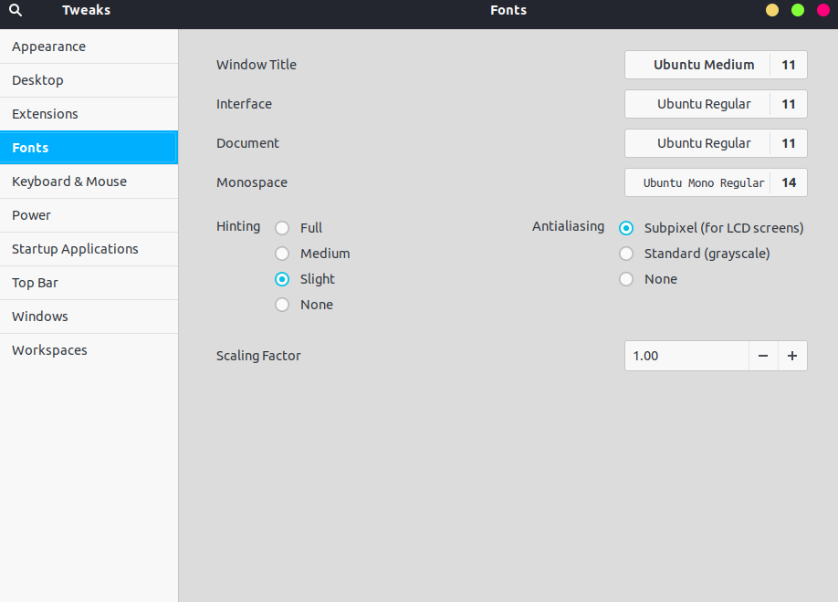
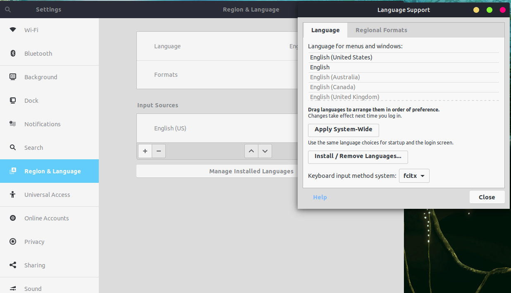
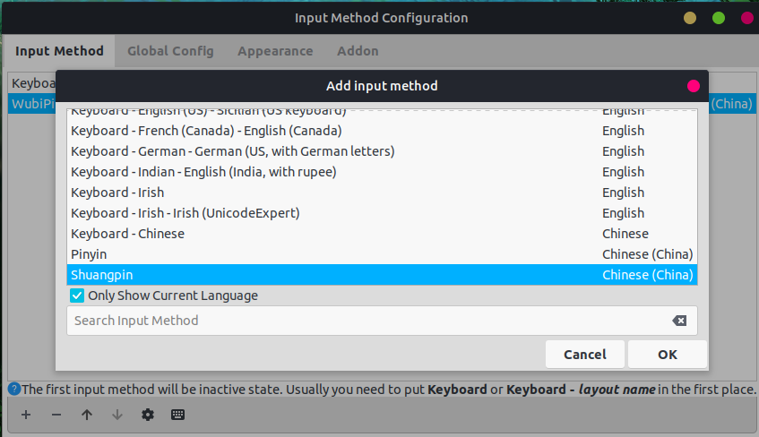

之所以要使用英文版的Ubuntu操作系统，原因有两个：
1、锻炼自己的英文水平
2、ubuntu英文版的字体渲染，无论是渲染英文字体还是中文字体，都比中文版的要漂亮很多。

下面以ubuntu 18.04为例，介绍一些相关的设置。

# 系统字体设置

在linux下，字体是一个永远绕不过去的话题，字体如果渲染不好怎么看怎么别扭。
同时字体的美观也是一个很主观的事情，同样的渲染效果，不同的人看来有不同的喜好。
以下配置对我来说是看起来最舒服的。

## 英文字体设置

在Linux下，英文字体推荐使用`ubuntu`字体族。
Ubuntu 18.04自带了这套字体，其他发行版安装源里都有，自行安装即可。
使用gnome-tweaks来调整字体设置。如下图：

这里没什么可说的。如果要调整，也就是根据屏幕分辨率，调整`scaling factor`，也就是windows下的缩放比例。

<!--more-->

## 中文字体设置

中文字体有三套就足够了：
1\. Noto CJK：目前包含字符最全的一套中文字体，对我来说也是效果最差的。
2\. WQY Micro Hei：中文字体美化的先驱者，现在看来也很漂亮。
3\. Microsoft YaHei：有版权的可以使用，效果出色。

### 调整中文字体的优先级

首先说一下，中文字体优先级问题也是英文版操作系统的一个优势。
中文版的Linux系统，如果安装uming和ukai这两套字体，整个系统界面的字体都会变成宋体和楷体，非常难看。
而英文版就没有这个问题了。

1.  编辑`/etc/fonts/conf.d/64-language-selector-prefer.conf`这个文件：
    在每一种字型的设置里，把你想要的字体提到最前面，比如Microsoft YaHei，如下：

```xml
    <?xml version="1.0"?>
    <!DOCTYPE fontconfig SYSTEM "fonts.dtd">
    <fontconfig>
    	<alias>
    		<family>sans-serif</family>
    		<prefer>
    			<family>Microsoft YaHei</family>
    			<family>Noto Sans CJK SC</family>
    		</prefer>
    	</alias>
    	<alias>
    		<family>serif</family>
    		<prefer>
    			<family>Microsoft YaHei</family>
    			<family>Noto Serif CJK SC</family>
    		</prefer>
    	</alias>
    	<alias>
    		<family>monospace</family>
    		<prefer>
    			<family>Noto Sans Mono CJK SC</family>
    		</prefer>
    	</alias>
    </fontconfig>
```
2.  编辑`/etc/fonts/conf.d/69-language-selector-zh-cn.conf`这个文件。
    同样，在每一种字型的设置里，把你想要的字体提到最前面，比如`WenQuanYi Micro Hei`，如下：


```xml 
   <?xml version="1.0"?>
    <!DOCTYPE fontconfig SYSTEM "fonts.dtd">
    <fontconfig>

    	<match target="pattern">
            <test name="lang">
                <string>zh-cn</string>
            </test>
    		<test qual="any" name="family">
    			<string>serif</string>
    		</test>
    		<edit name="family" mode="prepend" binding="strong">
    			<string>WenQuanYi Micro Hei</string>
    			<string>Microsoft YaHei</string>
    			<string>Noto Serif CJK SC</string>
    		</edit>
    	</match>
    	<match target="pattern">
    		<test qual="any" name="family">
    			<string>sans-serif</string>
    		</test>
            <test name="lang">
                <string>zh-cn</string>
            </test>
    		<edit name="family" mode="prepend" binding="strong">
    			<string>WenQuanYi Micro Hei</string>
    			<string>Microsoft YaHei</string>
    			<string>Noto Sans CJK SC</string>
    		</edit>
    	</match>
    	<match target="pattern">
    		<test qual="any" name="family">
    			<string>monospace</string>
    		</test>
            <test name="lang">
                <string>zh-cn</string>
            </test>
    		<edit name="family" mode="prepend" binding="strong">
    			<string>Ubuntu Mono</string>
    			<string>DejaVu Sans Mono</string>
    			<string>Noto Sans Mono CJK SC</string>
    		</edit>
    	</match>

    </fontconfig>
```
如果你有喜欢的字体，提到这两个配置文件的最前面即可。感觉64这个文件的优先级比69高。
这样，中文字体就设置完成了。系统英文会使用ubuntu，中文则使用你选择的中文字体。

# 中文输入法设置

在Ubuntu下可以正常使用fcitx输入法。

## 安装fcitx

`sudo apt install fcitx fcitx-table-wbpy`

## 设置fcitx

1.  打开`Settings`-->`Region & Language`-->`Manage Installed Language`，在最下方的
    `Keyboard input method system`里，选中fcitx：
    
    然后**重启操作系统**，不然会打不开fcitx输入法设置。
2.  在fcitx里添加中文输入法，比如wbpy（五笔拼音）。
    
    安装完毕，可以像中文版系统一样使用fcitx，没有任何区别。
    # 系统美化设置
    美化也就是设置主题、图标、壁纸之类的东西，漂亮的主题让人心情愉悦，间接提高工作效率。
    ## 必备的插件
3.  安装`chrome-gnome-shell`
    `sudo apt install chrome-gnome-shell`
    这个是必备的，没有这个软件，使用firefox无法在线安装扩展。不要被名字欺骗，firefox也是用这个。
4.  安装`User Themes`
    [安装地址](https://extensions.gnome.org/extension/19/user-themes/)
    这个也是必备的，用来在`gnome-tweaks`里更改`shell`主题。
5.  安装`Dash to Panel`
    [下载地址](https://extensions.gnome.org/extension/1160/dash-to-panel/)
    这个基本上算是必备的，作用是把左侧dash和上方的菜单栏挪到底部并统一起来，看下图：
    
    ## 主题和图标
6.  主题：[Ant-Nebula](https://github.com/EliverLara/Ant-Nebula)
    这个主题色彩明快，对比分明，右上角三个图标是仿mac格式的。
7.  图标：[Vimix](https://github.com/vinceliuice/vimix-icon-theme)
    这个图标算是还满意吧，没找到更好看的前先用它。
