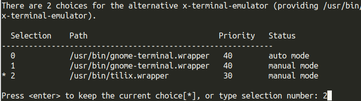

tilix是linux下的一种平铺式的终端应用程序。
平铺式是指它可以在同一个窗口内平铺式的显示多个shell，这样在需要多个shell之间对比调试的的时候就显得非常方便了。
tilix内置了多种主题，可以说是开箱即用。

# 安装tlix

`sudo apt install tilix`

# 设置tilix

官方提示在开始使用前，需要做一些设置来解决一些小问题：

## 编辑`~/.bashrc`（如果是zsh就编辑`~/.zshrc`）

在文件的最后添加如下内容：

    if [ $TILIX_ID ] || [ $VTE_VERSION ]; then
            source /etc/profile.d/vte.sh
    fi

<!--more-->

## 建立链接

`sudo ln -s /etc/profile.d/vte-2.91.sh /etc/profile.d/vte.sh`

## 更新bash配置

`source ~/.bashrc`

# 设置tilix为gnome默认的终端

`sudo update-alternatives --config x-terminal-emulator`
根据提示选择tilix对应的数字,如图：

