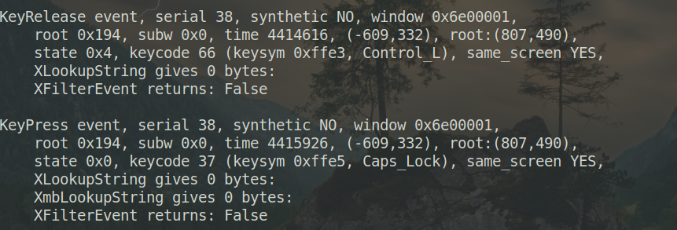

长久以来，在 Linux 使用 vmware 总是有个问题没有解决。

当在 Linux 里把 CTRL 和 CapsLock 这两个键互换后，vmware 的虚拟机里并不会跟着一起换，而依旧是原来的键位。同样的问题在 Windows 下就不存在。

今天，通过多方查找和实验，此问题终于完美解决，记录一下。

# vmware 的官方文档解释：

> Workstation Player 可通过检查当前的 X 键映射确定要使用的表。但这种决策过程有时也会失败。另外，每个映射都是固定的，不保证对任何给定的键盘和 X 按键代码-键盘符号映射都正确无误。例如，如果用户使用 xmodmap 互换 Ctrl 和 Caps Lock 按键，那么在使用远程服务器时虚拟机中的按键将互换（键盘符号映射），但在使用本地服务器时将取消互换（按键代码映射）。为了修正此问题，您必须在 Workstation Player 中重新映射按键。

也就是说，在本机上修改了键位，远程连接的 vmware 虚拟机里是正常的，本机上的虚拟机则不能使用。

# 问题的解决

官方给出的解决方案是：

<!--more-->

## 查看特定键位的值

使用`xev`或者`xmodmap -pk`查看 Ctrl 和 CapsLock 的键位值

可以看出，left Ctrl 键的值是 66,而 CapsLock 键的值是 37

## 查看键位对应的 V-Scan 值

到[V-Scan Code Table](https://pubs.vmware.com/workstation-9/index.jsp?topic=%2Fcom.vmware.ws.using.doc%2FGUID-D2C43B86-32EF-44EA-A2ED-D890483D70BD.html)去查看。直接告诉大家：
Left Ctrl 的值是 0x01d
CapsLock 的值是 0x03a

## 添加配置文件

在`~/.vmware/config`（没有就新建一个）里添加如下配置：

    xkeymap.keycode.66 = 0x01d
    xkeymap.keycode.37 = 0x03a

至此，工作全部完成，vmware 里的虚拟机可以使用和 Host 一样的键位设置了。

# 踩过的大坑

这么简单的一个问题，官方文档有明确的说明了，为什么拖了好几年没解决呢？

主要问题有两个：

1、官方的文档里说，更改健位值的两行代码，加在虚拟机配置文件里(.vmx)或者`~/.vmware/config`都可以，其实不对。这两行代码只能加在`~/.vmware/config`，加在其他地方不起作用。这个坑是长期未解决此问题的主要原因。

2、添加这两行配置后，最好是重新启动系统，以便让 vmware 服务彻底重启。我不知道这有没有必要，反正我是重启了。
